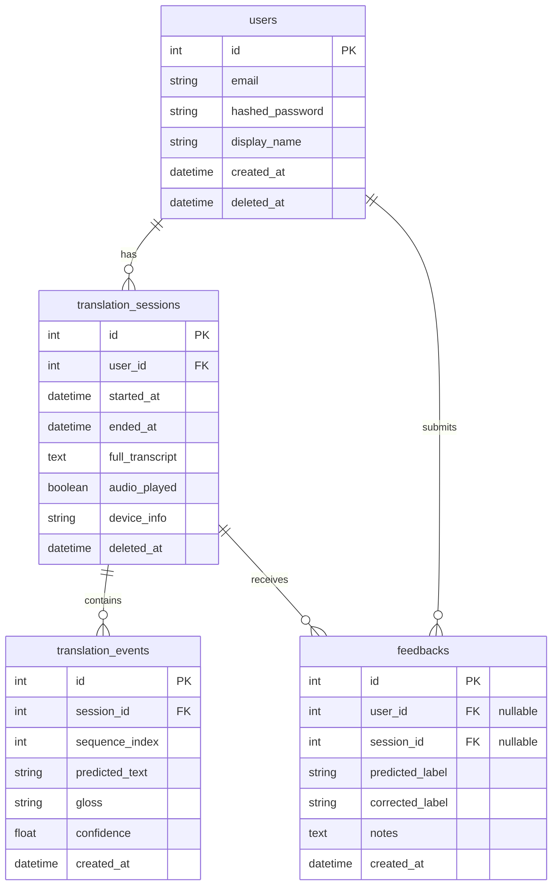

# Real-Time Sign Language Translator Backend

This is the FastAPI backend for the ASL Translator.

## Database Management

We use SQLAlchemy as the ORM and Alembic for database migrations.

### ER Diagram



### Running Migrations Locally

By default, the backend is configured to use a local SQLite database (`test.db`) for easy development if a PostgreSQL `DATABASE_URL` is not provided. 

To apply the latest database schema (whether using SQLite or PostgreSQL):
```bash
# Activate your virtual environment
.\venv\Scripts\Activate.ps1

# Run Alembic migrations
alembic upgrade head
```

### Generating New Migrations
When you change the SQLAlchemy models in `app/models/`, generate a new migration script:
```bash
alembic revision --autogenerate -m "Description of your changes"
alembic upgrade head
```

### Seeding the Database
To populate the database with a dummy user (`demo@example.com` / `password`) and sample translation sessions:
```bash
python seed.py
```
